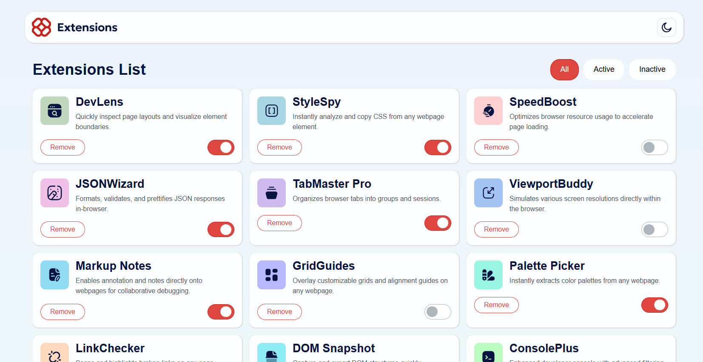

# Browser Extensions Manager UI 🧩

This is my solution to the Browser Extensions Manager UI challenge on **Frontend Mentor**. It's a fully functional dashboard for managing browser extensions with a premium look and feel.

## Features ✨
- **Dynamic Rendering:** Data is fetched from a [data.json](./data.json) file and rendered dynamically.
- **Theme Switcher:** Seamless toggle between Dark and Light modes with persistent state and icon updates.
- **Filtering System:** Users can filter extensions by status (All, Active, Inactive).
- **Deletion Logic:** Extensions can be removed from the list in real-time.
- **Responsive Layout:** Mobile-first approach, fully optimized for all screen sizes (Desktop, Tablet, and Mobile).

## Tech Stack 🛠️
- **Semantic HTML5**
- **CSS3 (Custom Variables, Flexbox, and Grid)**
- **Vanilla JavaScript (ES6+)**
- **BEM Methodology:** Clean and scalable CSS naming convention.

## What I Learned 🧠
During this project, I improved my skills in:
- Planning a project on paper before writing code.
- Managing Global Scope and State in JavaScript.
- Implementing a robust Dark/Light mode system.
- Using Flexbox and CSS Grid for complex layouts.

## Preview 📸

